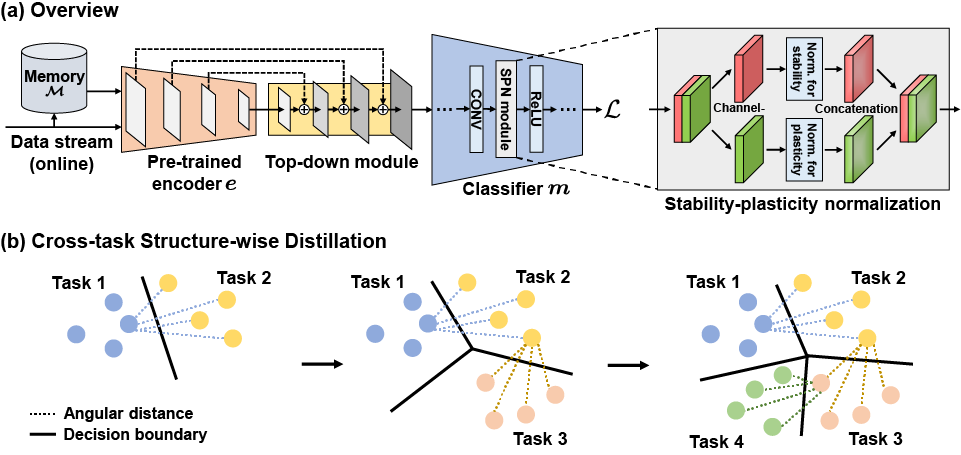

# New Insights for the Stability-Plasticity Dilemma in Online Continual Learning (MuFAN)

This project contains the implementation of the following ICLR 2023 paper: 

**Title:** New Insights for the Stability-Plasticity Dilemma in Online Continual Learning (ICLR 2023) [[openreview]](https://openreview.net/pdf?id=fxC7kJYwA_a). 

**Authors:** Dahuin Jung, Dongjin Lee, Sunwon Hong, Hyemi Jang, Ho Bae, Sungroh Yoon

MuFAN proposes a novel online continual learning framework that utilizes multi-scale feature maps in addition to a structure-wise distillation loss and a stability-plasticity normalization module to maintain high stability and plasticity simultaneously.



# Requirements
- python 3.8.13
- pytorch 1.11.0
- torchvision 0.8.1
- timm 0.4.9

# Benchmarks
### 1. Prepare data
The `data/` folders contains the train and test splits for the miniImageNet and CORE50 benchmarks. Download the raw data and modify the path in the `csv` files to point to the raw data folder.

### 2. Run experiments
To replicate the results, run
```
chmod +x scripts/task_aware.sh
bash scripts/task_aware.sh 0
```

The results will be put in the `resuts/` folders.

# Acknowledgement
This project structure is based on the [DualNet](https://github.com/phquang/DualNet) repository.
* https://github.com/phquang/DualNet

# Citation
If you found MuFAN useful for your research, please consider citing.
```
@inproceedings{
jung2023new,
title={New Insights for the Stability-Plasticity Dilemma in Online Continual Learning},
author={Dahuin Jung and Dongjin Lee and Sunwon Hong and Hyemi Jang and Ho Bae and Sungroh Yoon},
booktitle={International Conference on Learning Representations},
year={2023},
url={https://openreview.net/forum?id=fxC7kJYwA_a}
}
```
